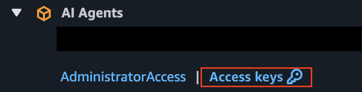
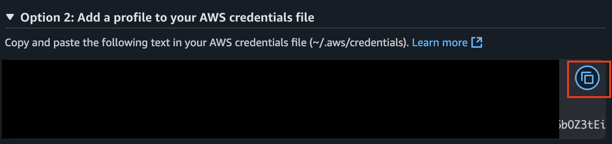

<h1 align="center">
    🚀 Site Reliability Engineer (SRE) Agent :detective:
</h1>

Welcome to the **SRE Agent** project! This open-source AI agent is here to assist your debugging, keep your systems healthy, and make your DevOps life a whole lot easier. Plug in your Kubernetes cluster, GitHub repo, and Slack, and let the agent do the heavy lifting—diagnosing, reporting, and keeping your team in the loop.

## 🌟 What is SRE Agent?

SRE Agent is your AI-powered teammate for monitoring application and infrastructure logs, diagnosing issues, and reporting diagnostics after errors. It connects directly into your stack, so you can focus on building, not firefighting.


## 🤔 Why Did We Build This?

We wanted to learn best practices, costs, security, and performance tips for AI agents in production. Our journey is open-source—check out our [Production Journey Page](/docs/production-journey.md) and [Agent Architecture Page](/docs/agent-architecture.md) for the full story.

We've been writing blogs and sharing our learnings along the way. Check out our [blog](https://www.fuzzylabs.ai/blog) for insights and updates.

> **Contributions welcome!** [Join us](CONTRIBUTING.md) and help shape the future of AI-powered SRE.

## ✨ Features

- 🕵️‍♂️ **Root Cause Debugging** – Finds the real reason behind app and system errors
- 📜 **Kubernetes Logs** – Queries your cluster for logs and info
- 🔍 **GitHub Search** – Digs through your codebase for bugs
- 💬 **Slack Integration** – Notifies and updates your team
- 🚦 **Diagnose from Anywhere** – Trigger diagnostics with a simple endpoint

> Powered by the [Model Context Protocol (MCP)](https://github.com/modelcontextprotocol) for seamless LLM-to-tool connectivity.

## 🤖 Supported LLM Providers

The SRE Agent supports multiple the following LLM providers:

### Anthropic
- **Models**: e.g. "claude-4-0-sonnet-latest"
- **Setup**: Requires `ANTHROPIC_API_KEY`

### Google Gemini
- **Models**: e.g, "gemini-2.5-flash"
- **Setup**: Requires `GEMINI_API_KEY`


## 🛠️ Prerequisites

- [Docker](https://docs.docker.com/get-docker/)
- A `.env` file in your project root ([see below](#getting-started))
- An app deployed on AWS EKS (Elastic Kubernetes Service) or GCP GKE (Google Kubernetes Engine)

## ⚡ Getting Started

Ready to see the agent in action? Our setup script will guide you through credential configuration, then you'll manually start the containers.

### 🚀 Credential Setup

Use our interactive setup script to configure your credentials:

```bash
python setup_credentials.py
```

The script will:
- ✅ Auto-detect your platform (AWS/GCP) or let you choose
- ✅ Guide you through credential setup with helpful prompts
- ✅ Show current values and let you update them
- ✅ Create your `.env` file automatically

### 🔧 Setup Options

**Quick start with platform selection:**
```bash
python setup_credentials.py --platform aws
# or
python setup_credentials.py --platform gcp
```


### 1️⃣ Connect to Your Kubernetes Cluster

#### For AWS EKS:
1. Go to your AWS access portal and grab your access keys:
   
2. Choose Option 2 and copy credentials into `~/.aws/credentials`:
   

   ```bash
   [default]
   aws_access_key_id=ABCDEFG12345
   aws_secret_access_key=abcdefg123456789
   aws_session_token=abcdefg123456789....=
   ```

#### For GCP GKE:
Set up your GCP credentials using the gcloud CLI:
```bash
gcloud auth login
gcloud config set project YOUR_PROJECT_ID
```

### 2️⃣ Start the Containers

After setting up your credentials, start the containers manually:

**For AWS:**
```bash
docker compose -f compose.aws.yaml up --build
```

**For GCP:**
```bash
docker compose -f compose.gcp.yaml up --build
```

<details>
<summary>🚢 Deploy with ECR images</summary>

See [ECR Setup](docs/ecr-setup.md) for details.

```
docker compose -f compose.ecr.yaml up
```

</details>

> **Note:** AWS credentials must be in your `~/.aws/credentials` file.

You'll see logs like this when everything's running:

```bash
orchestrator-1   |    FastAPI   Starting production server 🚀
orchestrator-1   |
orchestrator-1   |              Searching for package file structure from directories with
orchestrator-1   |              __init__.py files
kubernetes-1     | ✅ Kubeconfig updated successfully.
kubernetes-1     | 🚀 Starting Node.js application...
orchestrator-1   |              Importing from /
orchestrator-1   |
orchestrator-1   |     module   📁 app
orchestrator-1   |              ├── 🐍 __init__.py
orchestrator-1   |              └── 🐍 client.py
orchestrator-1   |
orchestrator-1   |       code   Importing the FastAPI app object from the module with the following
orchestrator-1   |              code:
orchestrator-1   |
orchestrator-1   |              from app.client import app
orchestrator-1   |
orchestrator-1   |        app   Using import string: app.client:app
orchestrator-1   |
orchestrator-1   |     server   Server started at http://0.0.0.0:80
orchestrator-1   |     server   Documentation at http://0.0.0.0:80/docs
orchestrator-1   |
orchestrator-1   |              Logs:
orchestrator-1   |
orchestrator-1   |       INFO   Started server process [1]
orchestrator-1   |       INFO   Waiting for application startup.
orchestrator-1   |       INFO   Application startup complete.
orchestrator-1   |       INFO   Uvicorn running on http://0.0.0.0:80 (Press CTRL+C to quit)
kubernetes-1     | 2025-04-24 12:53:00 [info]: Initialising Kubernetes manager {
kubernetes-1     |   "service": "kubernetes-server"
kubernetes-1     | }
kubernetes-1     | 2025-04-24 12:53:00 [info]: Kubernetes manager initialised successfully {
kubernetes-1     |   "service": "kubernetes-server"
kubernetes-1     | }
kubernetes-1     | 2025-04-24 12:53:00 [info]: Starting SSE server {
kubernetes-1     |   "service": "kubernetes-server"
kubernetes-1     | }
kubernetes-1     | 2025-04-24 12:53:00 [info]: mcp-kubernetes-server is listening on port 3001
kubernetes-1     | Use the following url to connect to the server:
kubernetes-1     | http://localhost:3001/sse {
kubernetes-1     |   "service": "kubernetes-server"
kubernetes-1     | }
```

This means all the services — Slack, GitHub, the orchestrator, the prompt and the MCP servers have started successfully and are ready to handle requests.

## 🧑‍💻 Using the Agent

Trigger a diagnosis with a simple curl command:

```bash
curl -X POST http://localhost:8003/diagnose \
  -H "accept: application/json" \
  -H "Authorization: Bearer <token>" \
  -d "text=<service>"
```

- Replace `<token>` with your dev bearer token (from `.env`)
- Replace `<service>` with the name of your target Kubernetes service

The agent will do its thing and report back in your configured Slack channel 🎉

<details>
<summary>🩺 Checking Service Health</summary>

A `/health` endpoint is available on the orchestrator service:

```bash
curl -X GET http://localhost:8003/health
```

- `200 OK` = All systems go!
- `503 Service Unavailable` = Something's up; check the response for details.

</details>

## 🚀 Deployments

Want to run this in the cloud? Check out our deployment examples:

- [EKS Deployment](https://github.com/fuzzylabs/sre-agent-deployment)

## 📚 Documentation

Find all the docs you need in the [docs](docs) folder:

- [Creating an IAM Role](docs/creating-an-iam-role.md)
- [ECR Setup Steps](docs/ecr-setup.md)
- [Agent Architecture](docs/agent-architecture.md)
- [Production Journey](docs/production-journey.md)
- [Credentials](docs/credentials.md)
- [Security Testing](docs/security-testing.md)

## 🙏 Acknowledgements & Attribution

Big thanks to:

- [Suyog Sonwalkar](https://github.com/Flux159) for the [Kubernetes MCP server](/sre_agent/servers/mcp-server-kubernetes/)
- [Anthropic's Model Context Protocol team](https://github.com/modelcontextprotocol) for the [Slack](/sre_agent/servers/slack/) and [GitHub](/sre_agent/servers/github/) MCP servers

## :book: Blogs

Check out our blog posts for insights and updates:

- [Bringing Agentic AI into the Real World](https://www.fuzzylabs.ai/blog-post/bringing-agentic-ai-into-the-real-world)
- [How We're Building an Autonomous SRE with FastMCP](https://www.fuzzylabs.ai/blog-post/how-were-building-an-autonomous-sre-with-fastmcp)
