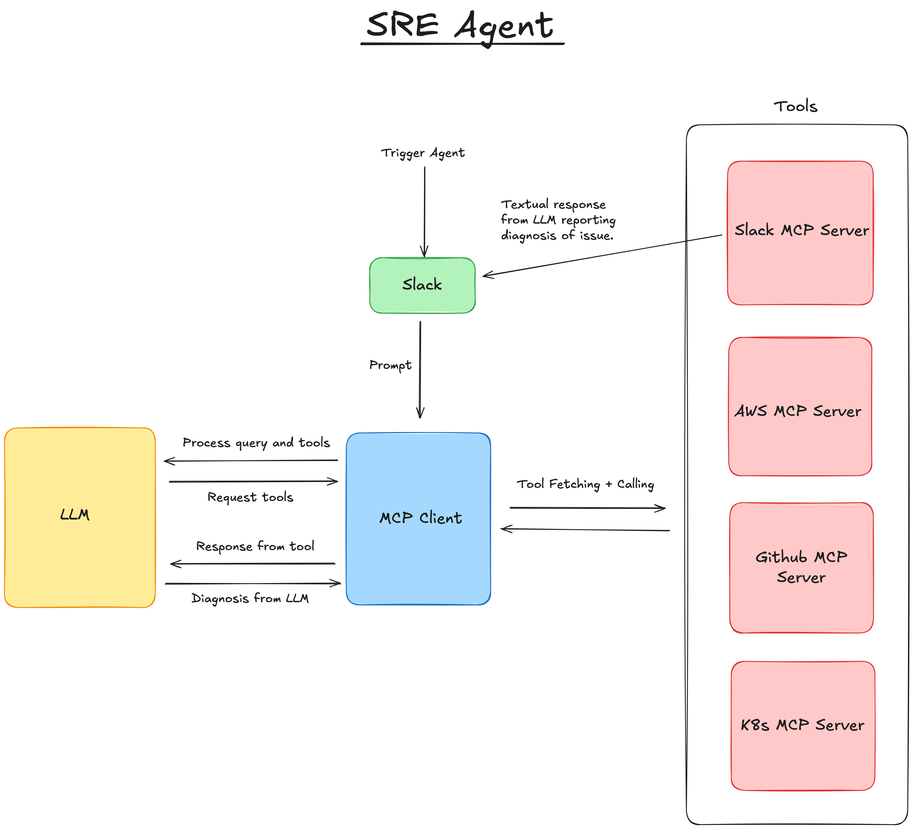
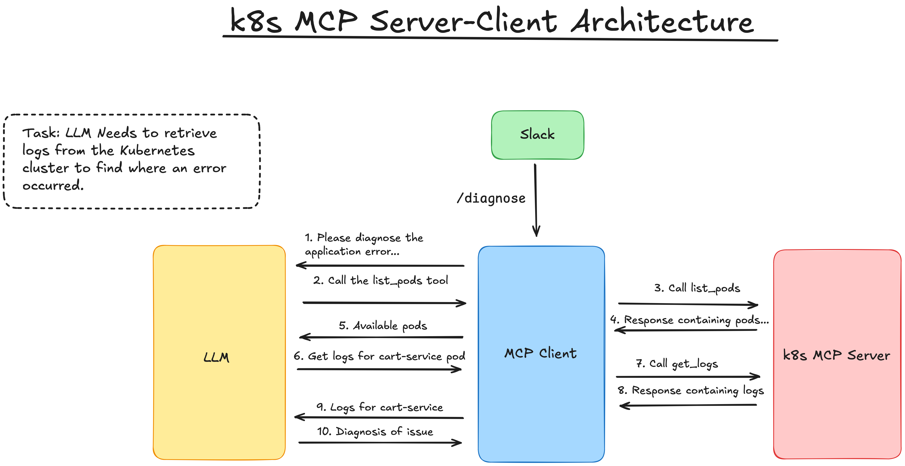
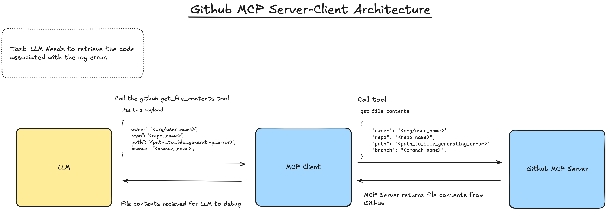

# Agent Architecture

The following diagram represents the overall architecture of the SRE agent. It consists of four MCP servers that communicate with an LLM via an MCP client. The agent is triggered by a Slack bot which sends a request to prompt the LLM via the MCP client.

MCP Servers:

- **AWS MCP Server**: This server is responsible for interacting with AWS services to retrieve information about the error and deployed services to diagnose an issue.
- **K8s MCP Server**: This server is responsible for interacting with a K8s cluster directly to retrieve information about the error from the logs.
- **Github MCP Server**: This server is responsible for interacting with the codebase in GitHub to identify the root cause of any application errors.
- **Slack MCP Server**: This server is responsible for sending a message back to the `site-reliability` channel in Slack.

## Individual Server-Client Architectures

### K8s MCP Server

The first step in the process is to use the K8s MCP server to retrieve the logs from the K8s cluster. The K8s MCP server will use the `kubectl` command line tool to retrieve the logs from the K8s cluster. The logs will be sent back to the agent for further analysis.

### Github MCP Server

Once the agent identifies the file containing the faulty code from the error logs, it accesses the Github MCP server to fetch the file's contents, which it provides to the LLM as context for error diagnosis.

### Slack MCP Server

Once the agent has been able to diagnose the root cause of the error using the AWS, K8s, and GitHub MCP servers it will use the Slack MCP server to package up the error diagnsosis and post it back to the `site-reliability` channel. In the event that the agent is unable to diagnose the issue, the Slack MCP server will send a message back to the `site-reliability` channel with the error message.

### AWS MCP Server

TBC
